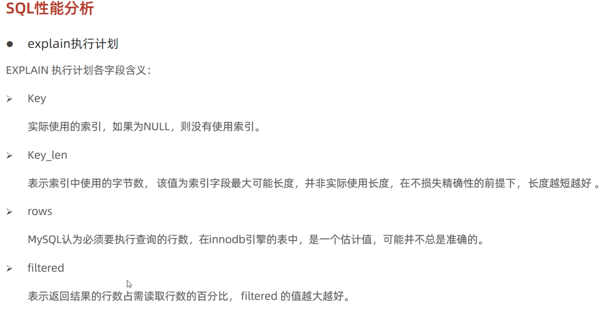
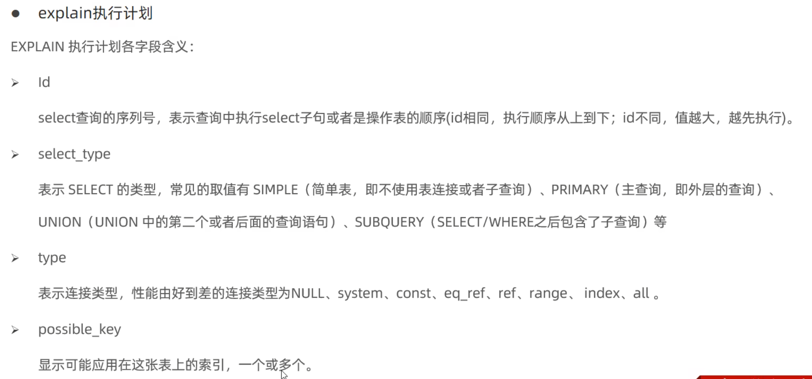
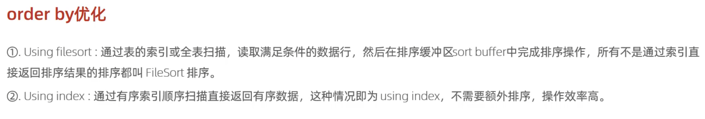

MySQL

多对多 中间表

一对多 多的外键

多表查询 内连接 外连接 

select e.name,e.age,e.job,d.name from emp e ,dept d where e.dept_id=d.id;

select e.name,e.age,e.job,d.name from emp e inner join dept d on e.dept_id=d.id where e.age<30;

显示内连接和隐式内连接区别在于语法、显示的明显，隐式where

select distinct d.id,d.name form emp e,dept d where e.dept_id=d.id;

 select e.*,d.name from emp e left join dept.d on e.dept_id =d.id where e.age>40;

select e.*, s.grade from emp e,salgrade s where e.salary>s.losal and e.salary<s.hisal;

select e.* s.grade

from dept d,emp e,salary s

where e.salary between s.losay and s.hisay and e.dept_id=d.id and d.name="研发部"；

select avg(e.salary)

from emp e,dept d

where d.name="研发部" and d.id=e.dept_id

select * from emp where salary > ( select salary from emp where name="灭绝" )

select * from emp where salary > ( select avg（salary） from emp )

select * from emp e2 where e2.salary<(select avg(e1.salary) from emp e1 where e1.dept=e2.dept);

select d.name ,d.id ,(select count(*) from emp e where e.dept_id=d.id) as "人数" from dept d；

git pull origin main --allow-unrelated-histories

https://blog.csdn.net/SweetoRm/article/details/134137053

 

上溢操作

块默认16k

show index from

drip index name **on**

  

执行频次 7个下划线

慢查询 etc/my.cnf

 

   

对username，password联合索引，覆盖索引，不会回表查询

use index

sql优化 

 

group by 也可以用聚合索引
